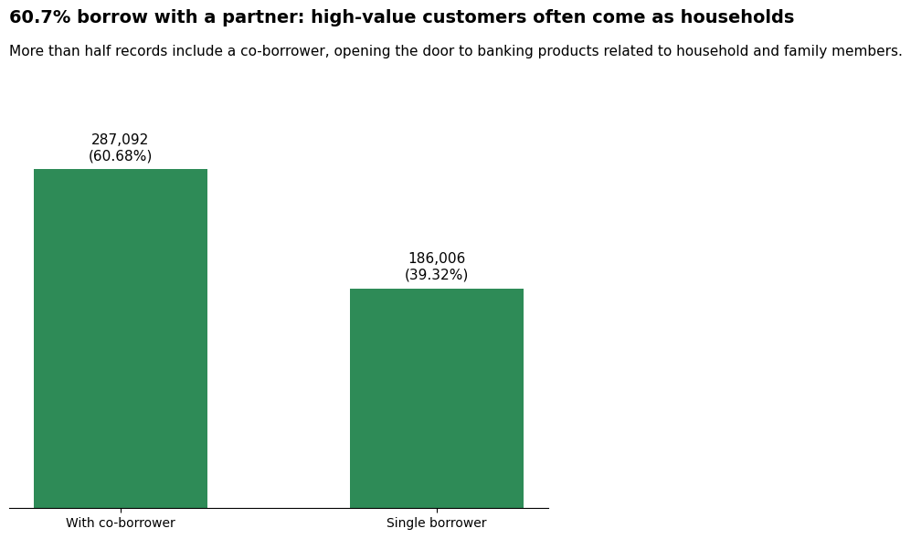

# Beyond the Mortgage: Unlocking New Opportunities for The Bank

ความสัมพันธ์ระหว่างผู้กู้และผู้ให้กู้อาจไม่ได้สิ้นสุดลงเมื่อสินเชื่อได้รับการอนุมัติ
การซื้อบ้านเป็นหนึ่งในการตัดสินใจระยะยาวของผู้กู้ ทั้งรายได้ ภาระหนี้ เงินสำรอง การใช้จ่าย และเป้าหมายทางการเงินในอนาคต

ทำให้เกิดคำถามขึ้นว่า

**ถ้าเรามองผู้กู้สินเชื่อบ้านไม่ใช่แค่ในฐานะ “คนที่มีหนี้บ้าน” แต่เป็นกลุ่มคนที่มีสถานะทางการเงินแตกต่างกัน เราจะค้นพบโอกาสทางการตลาดอะไรได้บ้าง?**

---

## Contents

1. [Overview](#overview)
2. [How Large Is the Mortgage Borrower Segment — and Why Should We Care?](#mortgage-overview)
3. [Why Could Mortgage Borrowers Represent a Banking Opportunity?](#mortgage-opportunity)
4. [Which Mortgage Borrowers Should We Focus On?](#priority-segment)
5. [Who Are We Focusing On?](#borrower-profile)
6. [Potential Banking Opportunities](#potential-banking-opportunities)

---

## Overview

เพื่อสำรวจว่า กลุ่มผู้กู้สินเชื่อบ้านอาจนำไปสู่โอกาสทางการตลาดอะไรได้บ้าง เราใช้ข้อมูลจาก **Public Use Database ของ Federal Housing Finance Agency (FHFA)** ประเทศสหรัฐอเมริกา
FHFA เป็นหน่วยงานของรัฐบาลสหรัฐฯ ที่กำกับดูแลระบบการเงินที่อยู่อาศัย รวมถึง **Fannie Mae** และ **Freddie Mac** ซึ่งเป็น Government-Sponsored Enterprises (GSEs) ที่มีบทบาทสำคัญในตลาดสินเชื่อบ้าน โดยรับซื้อสินเชื่อจากผู้ให้กู้ในตลาดรอง (secondary mortgage market) เพื่อช่วยเพิ่มสภาพคล่องให้กับระบบสินเชื่อที่อยู่อาศัย

ในโปรเจกต์นี้ เราใช้ข้อมูลปี **2024** ของ Fannie Mae และ Freddie Mac ในระดับรายการสินเชื่อ (mortgage records) เพื่อมองหาความแตกต่างและรูปแบบที่เกิดขึ้นภายในกลุ่มผู้กู้
จุดประสงค์ของการวิเคราะห์คือการค้นหา **potential market segments** ที่มีลักษณะน่าสนใจ และอาจนำไปใช้เป็นแนวทางในการมองหาลูกค้าของธนาคารที่มีลักษณะใกล้เคียงกันต่อไป

การวิเคราะห์จะค่อย ๆ ไล่จากภาพกว้างไปสู่ภาพที่ชัดขึ้น — เริ่มจากดูว่า **กลุ่มผู้กู้ในข้อมูลนี้มีขนาดใหญ่แค่ไหน และทำไมจึงน่าสนใจ** จากนั้นพิจารณา **ภาระหนี้และรายได้** เพื่อหากลุ่มที่ควรโฟกัส ก่อนจะซูมเข้าไปดูว่า **กลุ่มนั้นมีลักษณะอย่างไร และอาจนำไปสู่โอกาสทางการเงินแบบไหนได้บ้าง**

**Mortgage Overview → Financial Opportunity → Priority Segment → Borrower Profile → Potential Banking Opportunities**

จากจุดนี้ การวิเคราะห์จึงเริ่มจากภาพรวมก่อนว่า เรากำลังมองกลุ่มที่ใหญ่แค่ไหน และสินเชื่อบ้านอยู่กับผู้กู้ในกรอบเวลาที่ยาวนานเพียงใด เพราะสองเรื่องนี้จะเป็นพื้นฐานก่อนพิจารณาว่าโอกาสทางธุรกิจอาจอยู่ตรงไหน

---

## How Large Is the Mortgage Borrower Segment — and Why Should We Care?

<em>Figure 1. Mortgage Records by GSE, 2024</em>

เมื่อมองจากข้อมูลทั้งหมดที่มี เราพบรายการสินเชื่อกว่า 2.01 ล้านรายการ จาก Fannie Mae และ Freddie Mac ตัวเลขนี้ทำให้เราเห็นก่อนว่า กลุ่มที่กำลังพูดถึงมีขนาดใหญ่พอที่จะมีความหลากหลายอยู่ภายในข้อมูลนั้น
แต่ความน่าสนใจไม่ได้อยู่ที่ **“จำนวน”** เพียงอย่างเดียว อีกด้านหนึ่งที่ควรมองต่อคือ สินเชื่อเหล่านี้มีกรอบเวลายาวนานแค่ไหน

<em>Figure 2. Distribution of Original Mortgage Terms</em>

เมื่อดูระยะเวลาสัญญากู้ พบว่าประมาณ 93% ของข้อมูลที่มีอายุสัญญาเงินกู้มากกว่า 20 ปี เมื่อมองสองภาพนี้ร่วมกัน เราจึงเห็นทั้ง **ขนาดของกลุ่ม** และ **กรอบเวลาทางการเงินที่ยาวนาน** และตรงนี้เองที่ทำให้เกิดคำถามต่อว่า

**ในช่วงเวลาหลายปีที่ผู้กู้ต้องบริหารสินเชื่อบ้าน พวกเขาอาจมีความต้องการทางการเงินอะไรอีกบ้าง?**

---

## Why Could Mortgage Borrowers Represent a Banking Opportunity?

จากภาพรวมข้างต้น เราเห็นว่าข้อมูลครอบคลุมรายการสินเชื่อจำนวนมาก และสินเชื่อส่วนใหญ่มีกรอบเวลายาวนานกว่า 20 ปี
แต่เพียงแค่ “มีจำนวนมาก” และ “อยู่ในระยะยาว” ยังไม่ได้หมายความว่าจะเป็นโอกาสทางธุรกิจทันที
บางคนอาจมีภาระหนี้คิดเป็นสัดส่วนสูงเมื่อเทียบกับรายได้ ขณะที่บางคนมีภาระต่ำกว่า หรือมีฐานรายได้สูง
เราจึงมองผู้กู้ผ่านสองมิติพื้นฐานก่อน คือ **ภาระหนี้เมื่อเทียบกับรายได้ (DTI)** และ **ระดับรายได้ (Income)**

### Key Metrics Used in the Analysis

ก่อนนำผู้กู้มาแบ่งกลุ่ม เราใช้ตัวชี้วัดทางการเงิน 2 ตัวเป็นหลัก ได้แก่ **Debt-to-Income Ratio (DTI)** และ **Area Median Income (AMI)**

| Metric | What it tells us | How it is used in this analysis |
|---|---|---|
| **DTI (Debt-to-Income Ratio)** | สัดส่วนภาระหนี้เมื่อเทียบกับรายได้ ยิ่ง DTI สูง ยิ่งมีรายได้ส่วนหนึ่งถูกใช้ไปกับภาระหนี้มากขึ้น | ในโปรเจกต์นี้แบ่งเป็น **ต่ำกว่า 36%**, **36% ถึงต่ำกว่า 50%**, และ **ตั้งแต่ 50% ขึ้นไป** |
| **AMI (Area Median Income)** | รายได้มัธยฐานของพื้นที่ ใช้เป็นเกณฑ์เปรียบเทียบระดับรายได้ของผู้กู้กับพื้นที่ที่อยู่อาศัย | ในโปรเจกต์นี้แบ่งเป็น **ต่ำกว่า 80% AMI**, **80% ถึงต่ำกว่า 120% AMI**, และ **ตั้งแต่ 120% AMI ขึ้นไป** |

ตัวอย่างเช่น **120% of AMI** หมายถึงรายได้อยู่ที่ประมาณ **1.2 เท่าของรายได้มัธยฐานของพื้นที่** หรือประมาณ 20% สูงกว่าค่ามัธยฐาน ไม่ได้หมายถึงสูงกว่าค่ามัธยฐาน 120%

ทั้ง DTI และ AMI ใช้เพื่อช่วย **แบ่งกลุ่มและเปรียบเทียบลักษณะของผู้กู้** ในโปรเจกต์นี้ ไม่ได้ใช้เพื่อตัดสินว่าผู้กู้มีเงินเหลือจริงหรือเหมาะกับผลิตภัณฑ์ทางการเงินใดโดยตรง

<em>Figure 3. Mortgage Records by Debt-to-Income Ratio</em>

เมื่อดูจาก Debt-to-Income Ratio หรือ DTI เราเห็นว่าผู้กู้มีระดับภาระหนี้แตกต่างกัน โดย 38.4% อยู่ในกลุ่ม DTI ต่ำกว่า 36%, 61.4% อยู่ระหว่าง 36% ถึงต่ำกว่า 50% และมีเพียง 0.2% ที่มี DTI ตั้งแต่ 50% ขึ้นไป

อย่างไรก็ตาม DTI ต่ำไม่ได้หมายความว่าผู้กู้มีเงินเหลือมาก เพราะ DTI แสดงเฉพาะภาระหนี้ที่ถูกนำมาคำนวณในระบบ ไม่ได้รวมค่าใช้จ่ายทั้งหมดของครัวเรือนหรือภาระอื่นที่ข้อมูลนี้ไม่ครอบคลุม

ดังนั้น DTI จึงถูกใช้เป็น **สัญญาณแรกในการมองความแตกต่างด้านภาระหนี้** ไม่ใช่ตัวตัดสินว่าผู้กู้พร้อมสำหรับผลิตภัณฑ์อื่น และเพราะภาระหนี้เป็นเพียงมิติเดียว เราจึงนำระดับรายได้เข้ามาดูควบคู่กัน

<em>Figure 4. Income Relative to Area Median Income (AMI)</em>

รายได้ในที่นี้คือ รายได้เมื่อเทียบกับ **รายได้มัธยฐานของพื้นที่ (Area Median Income: AMI)**
จากกราฟ เราพบว่า 48.5% ของผู้กู้อยู่ในกลุ่ม **รายได้ตั้งแต่ 120%** ขึ้นไป ขณะที่ **24.8%** อยู่ในช่วง 80% ถึงต่ำกว่า 120% และ 26.7% อยู่ในกลุ่มต่ำกว่า 80% ของ AMI

ภาพนี้ช่วยให้เราเห็นว่า ภายในกลุ่มผู้กู้สินเชื่อบ้านมีความแตกต่างด้านฐานรายได้อย่างชัดเจน แต่เช่นเดียวกับ DTI รายได้เพียงอย่างเดียวก็ยังไม่สามารถบอกได้ว่าผู้กู้มีความพร้อมทางการเงินมากน้อยเพียงใด คนที่รายได้สูงอาจมีภาระหนี้หรือค่าใช้จ่ายสูงได้เช่นกัน

ดังนั้น หากจะมองหา opportunity เราจึงไม่ควรดู DTI หรือรายได้แยกจากกัน แต่ควรพิจารณาสองมิตินี้ร่วมกัน

---

## Which Mortgage Borrowers Should We Focus On?

เมื่อนำ DTI และรายได้มาพิจารณาร่วมกัน เราสามารถมองเห็นได้ชัดขึ้นว่า ในกลุ่มผู้กู้ทั้งหมด มีกลุ่มใดที่มีลักษณะทางการเงินน่าสนใจเมื่อเทียบกับกลุ่มอื่น

<em>Figure 5. Priority Segment: Income × DTI</em>

จากการแบ่งกลุ่มตามระดับรายได้และ DTI พบว่า กลุ่มที่มี **DTI ต่ำกว่า 36% และมีรายได้ตั้งแต่ 120% ของ AMI ขึ้นไป** มีจำนวนประมาณ **473,098 รายการ หรือ 23.5%** ของข้อมูลในตารางนี้
กลุ่มนี้จึงถูกเลือกเป็น **Priority Segment** ของเรา เพราะมีทั้งฐานรายได้ที่ค่อนข้างสูงเมื่อเทียบกับพื้นที่ และภาระหนี้ที่อยู่ในระดับต่ำกว่าเมื่อเทียบกับรายได้

อย่างไรก็ตาม การอยู่ในกลุ่มนี้ไม่ได้หมายความว่าผู้กู้มีเงินเหลือมากหรือพร้อมซื้อผลิตภัณฑ์อื่นทันที แต่เมื่อเทียบกับกลุ่มอื่น กลุ่มนี้มีเหตุผลเพียงพอที่จะถูกเลือกมาพิจารณาต่อในเชิงธุรกิจ เมื่อเลือกได้แล้วว่าเราจะโฟกัสกลุ่มไหน คำถามถัดไปก็คือ

**แล้วผู้กู้ใน Priority Segment นี้เป็นใคร?**

---

## Who Are We Focusing On?

เมื่อเลือก Priority Segment ได้แล้ว เราจึงซูมเข้าไปดูว่า **ผู้กู้ในกลุ่มนี้มีลักษณะอย่างไร**

จากจุดนี้เป็นต้นไป การวิเคราะห์จะไม่ได้มองผู้กู้ทั้งหมดกว่า 2 ล้านรายการอีกต่อไป แต่โฟกัสเฉพาะกลุ่มที่มี **DTI ต่ำกว่า 36% และรายได้ตั้งแต่ 120% ของ AMI ขึ้นไป** จำนวนประมาณ **473,098 รายการ**

<em>Figure 6. Age Distribution of the Priority Segment</em>

สิ่งแรกที่เห็นคือ ผู้กู้ส่วนใหญ่อยู่ในช่วงอายุ **25–54 ปี** คิดเป็นประมาณ **76.8%** และกลุ่มที่มีจำนวนมากที่สุดคือช่วง **35–44 ปี** รองลงมาคือ **25–34 ปี**
อายุเพียงอย่างเดียวไม่ได้บอกว่าผู้กู้ต้องการผลิตภัณฑ์อะไร แต่ช่วยให้เราเห็นโครงสร้างอายุของกลุ่มที่เลือกชัดขึ้น และตั้งคำถามต่อได้ว่า **ในแต่ละช่วงอายุ พวกเขาอาจมีเป้าหมายทางการเงินแบบใดบ้าง**

<em>Figure 7. First-Time Homebuyer Status of the Priority Segment</em>

ถัดมาคือสถานะการซื้อบ้านครั้งแรก โดย **34% ถูกจัดเป็น First-Time Homebuyer** และ **66% ถูกจัดเป็น Not First-Time Homebuyer**
กราฟนี้ช่วยให้เราเห็นบริบทการถือครองบ้านเพิ่มเติม เพราะผู้ซื้อบ้านครั้งแรกกับผู้ที่เคยซื้อบ้านมาก่อนอาจมีโจทย์ทางการเงินที่แตกต่างกัน

<em>Figure 8. Borrowing Structure of the Priority Segment</em>

อีกมุมหนึ่งที่น่าสนใจคือ ผู้กู้ในกลุ่มนี้ไม่ได้กู้ในรูปแบบเดียวกันทั้งหมด บางรายการเป็นการกู้คนเดียว ขณะที่บางรายการมีผู้กู้ร่วม
ประมาณ **60.7% ของ Priority Segment ถูกจัดเป็นรายการที่มีผู้กู้ร่วม** เทียบกับประมาณ **39.3% ที่กู้คนเดียว** ซึ่งช่วยเปิดอีกมุมหนึ่งของความต้องการทางการเงิน เช่น การบริหารภาระร่วม การจัดการค่าใช้จ่าย หรือการวางแผนเป้าหมายร่วมกัน

เมื่อมองทั้งสามมิติร่วมกัน เราจึงเริ่มเห็น Priority Segment ได้ชัดขึ้น ไม่ใช่เพียงว่า **มีรายได้สูงและ DTI ต่ำ** แต่ยังเห็นบริบทของอายุ การซื้อบ้าน และรูปแบบการกู้เพิ่มเติม และเมื่อเราเริ่มรู้แล้วว่า **“เรากำลังโฟกัสใคร”** คำถามถัดไปก็คือ

**กลุ่มนี้อาจมีความต้องการทางการเงินอะไร และสามารถนำ insight เหล่านี้ไปต่อยอดเป็น product opportunities ได้อย่างไร?**

---

## Potential Banking Opportunities

จากการวิเคราะห์ เราเลือกกลุ่มที่มี **DTI ต่ำกว่า 36% และรายได้ตั้งแต่ 120% ของ AMI ขึ้นไป** เป็น Priority Segment เนื่องจากเป็นกลุ่มที่มีรายได้ค่อนข้างสูงเมื่อเทียบกับพื้นที่ และมีภาระหนี้ต่ำกว่าเมื่อเทียบกับรายได้

อย่างไรก็ตาม ข้อมูลชุดนี้ยังไม่สามารถบอกได้ว่าผู้กู้มีเงินเหลือจริงเท่าไร ถือผลิตภัณฑ์ทางการเงินอะไรอยู่ หรือมีเป้าหมายทางการเงินแบบใด

ดังนั้น opportunity ที่ได้จากการวิเคราะห์นี้จึงไม่ใช่การนำผลิตภัณฑ์ไปเสนอให้ผู้กู้ทันที แต่เป็นการใช้ profile ที่พบเป็น **starting point** เพื่อค้นหาลูกค้าของธนาคารที่มีลักษณะใกล้เคียงกัน แล้วตรวจสอบข้อมูลเพิ่มเติมก่อนเลือกข้อเสนอที่ดีที่สุด

### 1. Turn Mortgage Surplus into Automated Investment

Priority Segment มีทั้ง **รายได้ตั้งแต่ 120% ของ AMI ขึ้นไป และ DTI ต่ำกว่า 36%** ทำให้กลุ่มนี้เป็นจุดเริ่มต้นที่น่าสนใจสำหรับการค้นหาลูกค้าที่อาจมี financial capacity นอกเหนือจากการชำระสินเชื่อบ้าน

หากธนาคารนำ profile นี้ไป match กับฐานลูกค้าของตนเอง และพบว่าลูกค้ามี **เงินคงเหลือหลังรายรับ ค่าใช้จ่าย และภาระหนี้อย่างสม่ำเสมอ** สิ่งที่สามารถต่อยอดได้คือการเปลี่ยนส่วนหนึ่งของเงินเหลือนั้นไปสู่การสะสมสินทรัพย์

**Potential cross-sell**
- Automated Investment Plan
- Mutual Fund / DCA
- Brokerage Account
- Retirement Investment Account

แนวคิดเป็นการสร้าง journey จาก

**Mortgage Payment → Verified Monthly Surplus → Automated Investment**

ทำให้ mortgage relationship สามารถพัฒนาไปจากการบริหารหนี้ สู่การสะสมสินทรัพย์ในระยะยาว

---

### 2. First-Time Homebuyer → Build a Home Reserve First

ภายใน Priority Segment ประมาณ **34% ถูกจัดเป็น First-Time Homebuyer**

สำหรับกลุ่มนี้ การซื้อบ้านอาจไม่ได้จบลงที่การชำระค่างวด เพราะหลังจากเริ่มถือครองบ้านแล้ว ยังอาจมีค่าใช้จ่ายที่เกี่ยวข้องกับการดูแลบ้านหรือค่าใช้จ่ายที่เกิดขึ้นโดยไม่คาดคิด

ธนาคารอาจใช้สถานะ First-Time Homebuyer เป็นจุดเริ่มต้นเพื่อสำรวจว่า ลูกค้ามีเงินสำรองเพียงพอต่อค่าใช้จ่ายดูแลบ้านหรือไม่

**Potential cross-sell**

**Home Reserve Savings Account**
- ตั้งเป้าเงินสำรองสำหรับค่าใช้จ่ายเกี่ยวกับบ้าน
- Auto-transfer เงินเข้าบัญชีทุกเดือน
- เชื่อมการออมกับวันชำระ mortgage
- เมื่อเงินสำรองถึงระดับที่เหมาะสม จึงค่อยต่อยอดไปสู่การลงทุน

Financial journey อาจเป็น

**Mortgage → Home Reserve → Investment**

ไม่ได้เริ่มจากการเพิ่มผลิตภัณฑ์ แต่เริ่มจากการตอบโจทย์ความจำเป็นด้านการเงินที่อาจเกิดขึ้นหลังการซื้อบ้าน

---

### 3. Co-Borrower → Build a Shared Banking Relationship

อีกลักษณะที่เห็นได้ชัดใน Priority Segment คือประมาณ **60.7% ของรายการถูกจัดเป็นการกู้ที่มีผู้กู้ร่วม**

การกู้บ้านไม่ได้แสดงเพียงภาระทางการเงินของบุคคลเดียวเสมอไป แต่ในหลายกรณีเป็นภาระที่มีผู้กู้มากกว่าหนึ่งคนร่วมรับผิดชอบ

จุดนี้เปิดโอกาสให้ธนาคารต่อยอดไปสู่เครื่องมือที่ช่วยบริหารการเงินร่วมกัน

**Potential cross-sell**

**Shared Mortgage Account**
- Linked / Joint Transaction Account
- Automatic Mortgage Payment
- Shared Savings Goal
- Home Reserve Pocket
- Automatic contribution จากผู้กู้ร่วม

แทนที่จะมีเพียง mortgage account หนึ่งบัญชี ธนาคารอาจเปลี่ยน mortgage ให้เป็นจุดเริ่มต้นของ **shared banking relationship** ที่ครอบคลุมทั้งการชำระหนี้ การเก็บเงิน และการวางแผนเป้าหมายร่วมกัน

---

## From Cross-Selling Products to Identifying the Next Financial Need

จากสาม opportunity ข้างต้น สิ่งที่ข้อมูลชุดนี้ชี้ให้เห็นไม่ใช่ว่าผู้กู้ทุกคนควรได้รับผลิตภัณฑ์แบบเดียวกัน แต่สินเชื่อบ้านสามารถทำหน้าที่เป็นจุดเริ่มต้นในการตั้งคำถามว่า

**“หลังจากสินเชื่อบ้านแล้ว ความต้องการทางการเงินถัดไปของลูกค้าคืออะไร?”**

สำหรับลูกค้าที่มี financial surplus จริง อาจเป็น **การลงทุน**  
สำหรับ First-Time Homebuyer อาจเป็น **การสร้างเงินสำรองสำหรับบ้าน**  
และสำหรับผู้กู้ร่วม อาจเป็น **การบริหารการเงินร่วมกัน**

ดังนั้น opportunity ไม่ได้อยู่ที่การขายผลิตภัณฑ์ให้มากที่สุด แต่คือการใช้ข้อมูลเพื่อเลือก **next-best financial need** ที่เหมาะกับบริบทของลูกค้ามากที่สุด

> **Mortgage → Manage → Protect → Grow**
