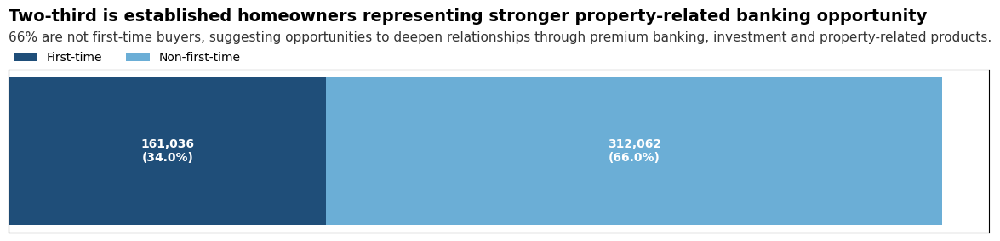

# Beyond the Mortgage: Unlocking New Opportunities for The Bank

ความสัมพันธ์ระหว่างผู้กู้และผู้ให้กู้อาจไม่ได้สิ้นสุดลงเมื่อสินเชื่อได้รับการอนุมัติ
การซื้อบ้านเป็นหนึ่งในการตัดสินใจระยะยาวของผู้กู้ ทั้งรายได้ ภาระหนี้ เงินสำรอง การใช้จ่าย และเป้าหมายทางการเงินในอนาคต

ทำให้เกิดคำถามขึ้นว่า

**ถ้าเรามองผู้กู้สินเชื่อบ้านไม่ใช่แค่ในฐานะ “คนที่มีหนี้บ้าน” แต่เป็นกลุ่มคนที่มีสถานะทางการเงินแตกต่างกัน เราจะค้นพบโอกาสทางการตลาดอะไรได้บ้าง?**

---

## Contents

1. [Overview](#overview)
2. [How Large Is the Mortgage Borrower Segment — and Why Should We Care?](#mortgage-overview)
3. [Why Could Mortgage Borrowers Represent a Banking Opportunity?](#mortgage-opportunity)
4. [Which Mortgage Borrowers Should We Focus On?](#priority-segment)
5. [Who Are We Focusing On?](#borrower-profile)
6. [Summary](#summary)
7. [Potential Banking Opportunities](#potential-banking-opportunities)

---

## Overview

เพื่อสำรวจว่า กลุ่มผู้กู้สินเชื่อบ้านอาจนำไปสู่โอกาสทางการตลาดอะไรได้บ้าง เราใช้ข้อมูลจาก **Public Use Database ของ Federal Housing Finance Agency (FHFA)** ประเทศสหรัฐอเมริกา
FHFA เป็นหน่วยงานของรัฐบาลสหรัฐฯ ที่กำกับดูแลระบบการเงินที่อยู่อาศัย รวมถึง **Fannie Mae** และ **Freddie Mac** ซึ่งเป็น Government-Sponsored Enterprises (GSEs) ที่มีบทบาทสำคัญในตลาดสินเชื่อบ้าน โดยรับซื้อสินเชื่อจากผู้ให้กู้ในตลาดรอง (secondary mortgage market) เพื่อช่วยเพิ่มสภาพคล่องให้กับระบบสินเชื่อที่อยู่อาศัย

ในโปรเจกต์นี้ เราใช้ข้อมูลปี **2024** ของ Fannie Mae และ Freddie Mac ในระดับรายการสินเชื่อ (mortgage records) เพื่อมองหาความแตกต่างและรูปแบบที่เกิดขึ้นภายในกลุ่มผู้กู้
จุดประสงค์ของการวิเคราะห์คือการค้นหา **potential market segments** ที่มีลักษณะน่าสนใจ และอาจนำไปใช้เป็นแนวทางในการมองหาลูกค้าของธนาคารที่มีลักษณะใกล้เคียงกันต่อไป

การวิเคราะห์จะเริ่มจาก **ขนาดของกลุ่มผู้กู้ในข้อมูลนี้** จากนั้นพิจารณาถึง **ภาระหนี้และรายได้** เพื่อหากลุ่มที่ควรโฟกัส จากนั้นจึงพิจารณาลักษณะและโอกาสจากกลุ่มดังกล่าว

**Mortgage Overview → Financial Opportunity → Priority Segment → Borrower Profile → Potential Banking Opportunities**

จากจุดนี้ การวิเคราะห์จึงเริ่มจากภาพรวมก่อนว่า เรากำลังมองกลุ่มที่ใหญ่แค่ไหน และสินเชื่อบ้านอยู่กับผู้กู้ในกรอบเวลาที่ยาวนานเพียงใด เพราะสองเรื่องนี้จะเป็นพื้นฐานก่อนพิจารณาว่าโอกาสทางธุรกิจอาจอยู่ตรงไหน

---

## How Large Is the Mortgage Borrower Segment — and Why Should We Care?

<em>Figure 1. Mortgage Records by GSE, 2024</em>

เมื่อมองจากข้อมูลทั้งหมดที่มี เราพบรายการสินเชื่อกว่า 2.01 ล้านรายการ จาก Fannie Mae และ Freddie Mac ตัวเลขนี้ทำให้เราเห็นก่อนว่า กลุ่มที่กำลังพูดถึงมีขนาดใหญ่พอที่จะมีความหลากหลายอยู่ภายในข้อมูลนั้น
แต่ความน่าสนใจไม่ได้อยู่ที่ **“จำนวน”** เพียงอย่างเดียว อีกด้านหนึ่งที่ควรมองต่อคือ สินเชื่อเหล่านี้มีกรอบเวลายาวนานแค่ไหน

<em>Figure 2. Distribution of Original Mortgage Terms</em>

เมื่อดูระยะเวลาสัญญากู้ พบว่าประมาณ 93% ของข้อมูลที่มีอายุสัญญาเงินกู้มากกว่า 20 ปี เมื่อมองสองภาพนี้ร่วมกัน เราจึงเห็นทั้ง **ขนาดของกลุ่ม** และ **กรอบเวลาทางการเงินที่ยาวนาน** และตรงนี้เองที่ทำให้เกิดคำถามต่อว่า

**ในช่วงเวลาหลายปีที่ผู้กู้ต้องบริหารสินเชื่อบ้าน พวกเขาอาจมีความต้องการทางการเงินอะไรอีกบ้าง?**

---

## Why Could Mortgage Borrowers Represent a Banking Opportunity?

จากภาพรวมข้างต้น เราเห็นว่าข้อมูลครอบคลุมรายการสินเชื่อจำนวนมาก และสินเชื่อส่วนใหญ่มีกรอบเวลายาวนานกว่า 20 ปี
แต่เพียงแค่ “มีจำนวนมาก” และ “อยู่ในระยะยาว” ยังไม่ได้หมายความว่าจะเป็นโอกาสทางธุรกิจทันที
บางคนอาจมีภาระหนี้คิดเป็นสัดส่วนสูงเมื่อเทียบกับรายได้ ขณะที่บางคนมีภาระต่ำกว่า หรือมีฐานรายได้สูง
เราจึงมองผู้กู้ผ่านสองมิติพื้นฐานก่อน คือ **ภาระหนี้เมื่อเทียบกับรายได้ (DTI)** และ **ระดับรายได้ (Income)**

### Key Metrics Used in the Analysis

ก่อนนำผู้กู้มาแบ่งกลุ่ม เราใช้ตัวชี้วัดทางการเงิน 2 ตัวเป็นหลัก ได้แก่ **Debt-to-Income Ratio (DTI)** และ **Area Median Income (AMI)**

| Metric | What it tells us | How it is used in this analysis |
|---|---|---|
| **DTI (Debt-to-Income Ratio)** | สัดส่วนภาระหนี้เมื่อเทียบกับรายได้ ยิ่ง DTI สูง ยิ่งมีรายได้ส่วนหนึ่งถูกใช้ไปกับภาระหนี้มากขึ้น | ในโปรเจกต์นี้แบ่งเป็น **ต่ำกว่า 36%**, **36% ถึงต่ำกว่า 50%**, และ **ตั้งแต่ 50% ขึ้นไป** |
| **AMI (Area Median Income)** | รายได้มัธยฐานของพื้นที่ ใช้เป็นเกณฑ์เปรียบเทียบระดับรายได้ของผู้กู้กับพื้นที่ที่อยู่อาศัย | ในโปรเจกต์นี้แบ่งเป็น **ต่ำกว่า 80% AMI**, **80% ถึงต่ำกว่า 120% AMI**, และ **ตั้งแต่ 120% AMI ขึ้นไป** |

ตัวอย่างเช่น **120% of AMI** หมายถึงรายได้อยู่ที่ประมาณ **1.2 เท่าของรายได้มัธยฐานของพื้นที่** หรือประมาณ 20% สูงกว่าค่ามัธยฐาน ไม่ได้หมายถึงสูงกว่าค่ามัธยฐาน 120%

ทั้ง DTI และ AMI ใช้เพื่อช่วย **แบ่งกลุ่มและเปรียบเทียบลักษณะของผู้กู้** ในโปรเจกต์นี้ ไม่ได้ใช้เพื่อตัดสินว่าผู้กู้มีเงินเหลือจริงหรือเหมาะกับผลิตภัณฑ์ทางการเงินใดโดยตรง

<em>Figure 3. Mortgage Records by Debt-to-Income Ratio</em>

เมื่อดูจาก DTI เราเห็นว่าผู้กู้มีระดับภาระหนี้แตกต่างกัน โดย 38.4% อยู่ในกลุ่ม DTI ต่ำกว่า 36% (Low Burden), 61.4% อยู่ระหว่าง 36% ถึงต่ำกว่า 50% (Medium Burden)และมีเพียง 0.2% ที่มี DTI ตั้งแต่ 50% ขึ้นไป (High Burden)

อย่างไรก็ตาม DTI ต่ำไม่ได้หมายความว่าผู้กู้มีเงินเหลือมาก เพราะ DTI แสดงเฉพาะภาระหนี้ที่ถูกนำมาคำนวณในระบบ ไม่ได้รวมค่าใช้จ่ายทั้งหมดของครัวเรือนหรือภาระอื่นที่ข้อมูลนี้ไม่ครอบคลุม

ดังนั้น DTI จึงถูกใช้เป็น **สัญญาณแรกในการมองความแตกต่างด้านภาระหนี้** ไม่ใช่ตัวตัดสินว่าผู้กู้พร้อมสำหรับผลิตภัณฑ์อื่น และเพราะภาระหนี้เป็นเพียงมิติเดียว เราจึงนำระดับรายได้เข้ามาดูควบคู่กัน

<em>Figure 4. Income Relative to Area Median Income (AMI)</em>

รายได้ในที่นี้คือ รายได้เมื่อเทียบกับ **รายได้มัธยฐานของพื้นที่ (Area Median Income: AMI)**
จากกราฟ เราพบว่า 48.5% ของผู้กู้อยู่ในกลุ่ม **รายได้ตั้งแต่ 120%** ขึ้นไป (High Income) ขณะที่ 24.8% อยู่ในช่วง 80% ถึงต่ำกว่า 120% (Medium Income) และ 26.7% อยู่ในกลุ่มต่ำกว่า 80% ของ AMI (Low Income)

ภาพนี้ช่วยให้เราเห็นว่า ภายในกลุ่มผู้กู้สินเชื่อบ้านมีความแตกต่างด้านฐานรายได้อย่างชัดเจน แต่เช่นเดียวกับ DTI รายได้เพียงอย่างเดียวก็ยังไม่สามารถบอกได้ว่าผู้กู้มีความพร้อมทางการเงินมากน้อยเพียงใด คนที่รายได้สูงอาจมีภาระหนี้หรือค่าใช้จ่ายสูงได้เช่นกัน

ดังนั้น หากจะมองหา opportunity เราจึงไม่ควรดู DTI หรือรายได้แยกจากกัน แต่ควรพิจารณาสองมิตินี้ร่วมกัน

---

## Which Mortgage Borrowers Should We Focus On?

เมื่อนำ DTI และรายได้มาพิจารณาร่วมกัน เราสามารถมองเห็นได้ชัดขึ้นว่า ในกลุ่มผู้กู้ทั้งหมด มีกลุ่มใดที่มีลักษณะทางการเงินน่าสนใจเมื่อเทียบกับกลุ่มอื่น

<em>Figure 5. Priority Segment: Income × DTI</em>

จากการแบ่งกลุ่มตามระดับรายได้และ DTI พบว่า กลุ่มที่มี **DTI ต่ำกว่า 36% (Low Burden) และมีรายได้ตั้งแต่ 120% (High Income) ของ AMI ขึ้นไป** มีจำนวนประมาณ **473,098 รายการ หรือ 23.5%** ของข้อมูลในตารางนี้
กลุ่มนี้จึงถูกเลือกเป็น **Priority Segment** ของเรา เพราะมีทั้งฐานรายได้ที่ค่อนข้างสูงเมื่อเทียบกับพื้นที่ และภาระหนี้ที่อยู่ในระดับต่ำเมื่อเทียบกับรายได้

คำถามถัดไปก็คือ

**แล้วผู้กู้ใน Priority Segment นี้เป็นใคร?**

---

## Who Are We Focusing On?

เมื่อเลือก Priority Segment ได้แล้ว เราจึงซูมเข้าไปดูว่า **ผู้กู้ในกลุ่มนี้มีลักษณะอย่างไร**

จากจุดนี้เป็นต้นไป การวิเคราะห์จะไม่ได้มองผู้กู้ทั้งหมดกว่า 2 ล้านรายการอีกต่อไป แต่โฟกัสเฉพาะกลุ่มที่มี **DTI ต่ำกว่า 36% (Low Burden) และรายได้ตั้งแต่ 120% ของ AMI ขึ้นไป (High Income)** จำนวนประมาณ **473,098 รายการ**

<em>Figure 6. Age Distribution of the Priority Segment</em>

สิ่งแรกที่เห็นคือ ผู้กู้ส่วนใหญ่อยู่ในช่วงอายุ **25–54 ปี** คิดเป็นประมาณ **76.8%** ของ Priority Segment โดยกลุ่มที่มีจำนวนมากที่สุดคือช่วง **35–44 ปี** รองลงมาคือ **25–34 ปี**

อายุเพียงอย่างเดียวไม่ได้บอกว่าผู้กู้ต้องการผลิตภัณฑ์อะไร แต่สามารถใช้เป็นอีกมิติหนึ่งในการ refine potential investment opportunity ได้ โดยกลุ่มอายุ **25–54 ปี** อาจถูกนำไปสำรวจต่อสำหรับ **Mutual Fund / DCA** ขณะที่กลุ่ม **25–34 ปี** อาจมีโอกาสต่อยอดไปสู่ **Brokerage Account** และกลุ่ม **35–54 ปี** อาจใช้เป็นจุดเริ่มต้นในการพูดคุยเรื่อง **Retirement Investment Account**

<em>Figure 7. First-Time Homebuyer Status of the Priority Segment</em>

ถัดมาคือสถานะการซื้อบ้านครั้งแรก โดย **34% ถูกจัดเป็น First-Time Homebuyer** และ **66% ถูกจัดเป็น Non First-Time Homebuyer**

ข้อมูลนี้ช่วยเพิ่มบริบทให้กับ Priority Segment เพราะผู้ซื้อบ้านครั้งแรกและผู้ที่เคยซื้อบ้านมาก่อนอาจอยู่ในช่วงของการถือครองบ้านและมีความต้องการทางการเงินที่แตกต่างกัน 

<em>Figure 8. Borrowing Structure of the Priority Segment</em>

อีกลักษณะที่เห็นได้ชัดคือประมาณ **60.7% ของ Priority Segment ถูกจัดเป็นรายการที่มีผู้กู้ร่วม** เทียบกับประมาณ **39.3% ที่กู้คนเดียว**

การมีผู้กู้ร่วมเปิดโอกาสให้ธนาคารต่อไปสู่ **shared banking relationship**

Potential opportunity อาจประกอบด้วย **Linked / Joint Transaction Account** สำหรับจัดการเงินที่เกี่ยวข้องกับ mortgage ร่วมกัน, **Shared Savings Goal** สำหรับเป้าหมายทางการเงินร่วม และ **Home Reserve Pocket** สำหรับสะสมเงินค่าซ่อมหรือดูแลบ้าน โดย borrower และ co-borrower สามารถนำเงินเข้าร่วมกันผ่าน **Automatic Contribution**

**Borrower + Co-Borrower → Shared Account → Automatic Contribution → Shared Savings / Home Reserve**

---

## Summary 

<em>Figure 9. Potential Cross-Sell Segments Among Mortgage Customers</em>

จาก Priority Segment จำนวนประมาณ 473,098 รายการ เราพบลักษณะที่สามารถนำมาใช้ต่อยอดเป็น potential cross-sell ได้หลายมิติ โดยเฉพาะ ช่วงอายุ และ รูปแบบการกู้ร่วม

ในด้านอายุ กลุ่ม 25–54 ปี เป็นสัดส่วนหลักของ Priority Segment และสามารถใช้เป็นจุดเริ่มต้นในการสำรวจโอกาสด้านการลงทุน เช่น Mutual Fund / DCA โดยกลุ่ม 25–34 ปี อาจพิจารณา Brokerage Account และกลุ่ม 35–54 ปี อาจสำรวจความต้องการด้าน Retirement Investment เพิ่มเติม

ขณะเดียวกัน ประมาณ 60.7% ของ Priority Segment เป็นรายการที่มีผู้กู้ร่วม ซึ่งเปิดอีกโอกาสหนึ่งในการไปสู่ shared banking relationship เช่น Linked / Joint Transaction Account, Shared Savings Goal, Home Reserve Pocket และ Automatic Contribution

---

## Turning Insights into Banking Opportunities

ผลจากการวิเคราะห์นี้ไม่ได้บอกว่า ควรเสนอผลิตภัณฑ์อะไรให้ผู้กู้แต่ละคนทันที แต่ช่วยให้เราเห็นว่า **มีกลุ่มไหนที่น่าสนใจและควรนำไปดูต่อ**

หากธนาคารมีฐานลูกค้าสินเชื่อบ้านของตัวเอง สามารถนำลักษณะของ Priority Segment ที่พบจากข้อมูลนี้ไปค้นหาลูกค้าที่มี profile ใกล้เคียงกัน แล้วดูข้อมูลอื่นประกอบ เช่น เงินเข้า–ออกในบัญชี ยอดเงินคงเหลือ ผลิตภัณฑ์ที่มีอยู่แล้ว เป้าหมายทางการเงิน และความเหมาะสมในการลงทุน

จากนั้นพิจารณาว่า ลูกค้าแต่ละกลุ่มมีความต้องการอะไรเพิ่มเติม และผลิตภัณฑ์ใดอาจเหมาะที่จะนำไปทดลองเสนอ

**Priority Segment → Find Similar Bank Customers → Check Additional Data → Test the Offer**

ดังนั้น สิ่งที่ analysis นี้ให้ไม่ใช่คำตอบสำเร็จรูปว่า “ควรขายอะไรให้ใคร” แต่เป็นจุดเริ่มต้นที่ช่วยให้ธนาคารรู้ว่า **ควรมองใครก่อน และต้องดูข้อมูลอะไรเพิ่มก่อนนำไปใช้จริง**
